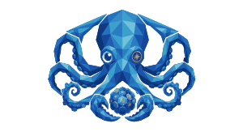
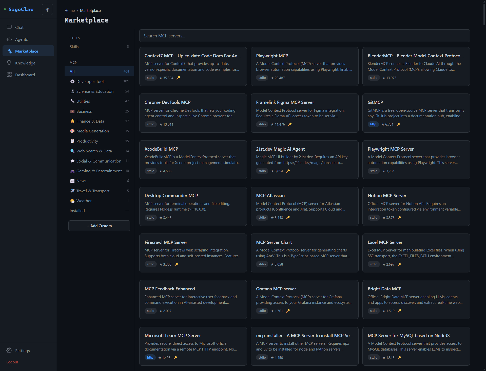
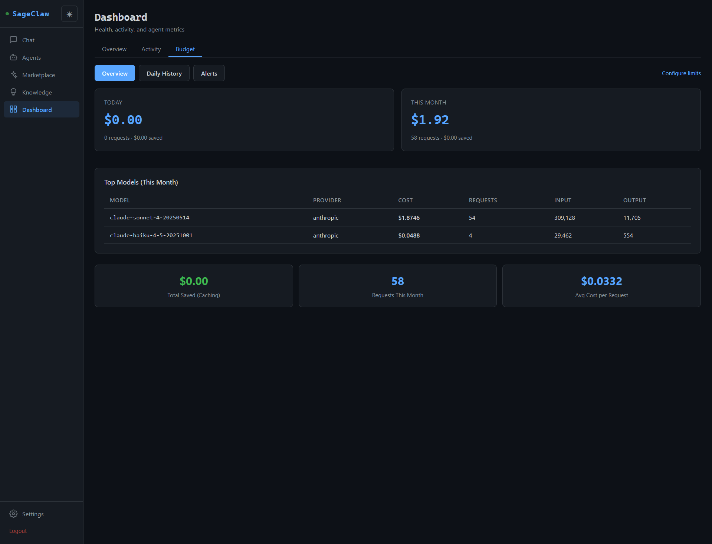
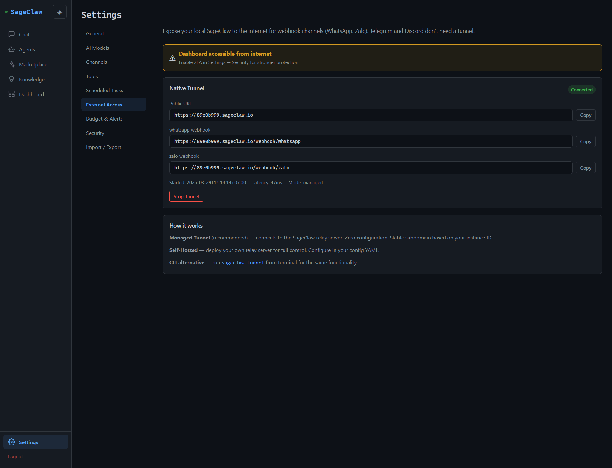
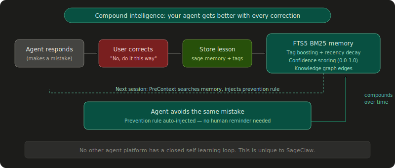
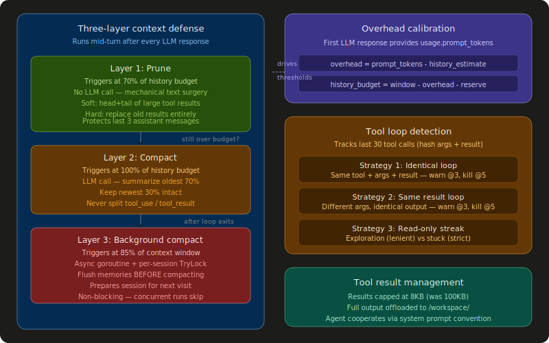

<h1 align="center">SageClaw</h1>
<p align="center">
  
</p>
<p align="center"><strong>Personal AI agents that compound experience.</strong></p>

<p align="center">
  <a href="#quick-start">Quick Start</a> · <a href="#screenshots">Screenshots</a> · <a href="#why-sageclaw">Why SageClaw</a> · <a href="#features">Features</a>
</p>

<p align="center">
  
  
  
  
</p>

---

Build AI agents that remember what they learned, work together when the job is too big for one, and run entirely on your hardware. Single binary. Local-first. Yours to own.

- **Learn** — Mistakes become guardrails. Corrections turn into prevention rules, injected in every future session. Background review extracts memories proactively.
- **Orchestrate** — One agent or a full team. Task boards, delegation, handoff, evaluate loops, workflow engine with deterministic state machines.
- **Extend** — Two built-in marketplaces: 401 MCP servers + skills.sh. Browse, install, and manage — works offline.
- **Stream** — Sequenced SSE events with catch-up replay. Frontend state machine handles multi-run flows, consent, and disconnection recovery.
- **Secure** — 5-layer injection protection, sandbox, AES-256-GCM credentials, budget enforcement with per-model pricing.
- **Own** — Your machine, your data, your keys. No telemetry. Consent by design — no one talks to your agent without your explicit approval.

```
Your agent makes a mistake → you correct it → the correction becomes a prevention rule →
injected automatically in every future session → the agent never makes that mistake again.

This is compound intelligence. No other agent platform does this.
```

## Quick Start

```bash
go build -o bin/sageclaw ./cmd/sageclaw
./bin/sageclaw
```

Open `localhost:9090` — the onboarding wizard walks you through connecting a provider, creating your first agent, and choosing a channel in under 2 minutes. No Docker. No PostgreSQL. No cloud account.

## Screenshots

**MCP Marketplace** — Browse 401 servers, filter by category, one-click install. Ships offline with a bundled index.



**Budget Tracking** — Per-model cost breakdown, daily/monthly limits, cache savings, and alerts.



**Native Tunnel** — Expose your local instance to the internet for webhook channels. Zero-config managed mode with stable subdomain.



## Why SageClaw

Most agent frameworks treat every conversation as a blank slate. Every session starts from zero. Mistakes repeat. Context is lost. The agent never gets better.

SageClaw is built on six principles that no other platform combines:

### 1. Agents that learn from their mistakes

When you correct your agent, the correction is stored as a self-learning entry with semantic tags. The next time the agent encounters a similar situation, the prevention rule is automatically injected into context via the PreContext middleware. Over weeks and months, your agent accumulates a growing library of lessons — it doesn't just execute, it improves.

**Background review** takes this further: every N user turns (configurable), a background goroutine reviews the conversation and extracts memories — user preferences, project context, corrections — without blocking the main loop. Complex tasks (5+ iterations) also trigger procedure extraction, creating reusable step-by-step guides with confidence scores that increase organically through use.

This is the closed self-learning loop. It's powered by sage-memory (FTS5 BM25 search with tag boosting and recency decay) and it's unique to SageClaw.



### 2. One binary, zero infrastructure

SageClaw compiles to a single Go binary with embedded SQLite, embedded web dashboard, and embedded MCP marketplace index. There is nothing to install, nothing to configure, and nothing to manage.

Compare this to the alternatives:
- **OpenClaw** — Node.js + npm + Gateway daemon + channel plugins
- **GoClaw** — Go binary + PostgreSQL + pgvector + Docker (optional)
- **DeerFlow** — Python + LangGraph + Node.js + Docker + Nginx + 4 services

SageClaw starts in under a second. It runs on a Raspberry Pi. It runs on a $5 VPS. It runs on your laptop. The binary IS the product.

### 3. Context engineering that survives long sessions

Agents that run 30+ iterations (research tasks, code reviews, overnight autoresearch) inevitably hit the context window ceiling. SageClaw manages this with a three-layer defense system that runs mid-turn after every LLM response:

**Layer 1 — Prune** (70% history budget): Mechanical surgery on old tool results. No LLM call, zero cost. Soft-trim large results to head+tail. Hard-clear old results entirely if still over budget. Never touches the last 3 assistant messages.

**Layer 2 — Compact** (100% history budget): LLM-based summarization. Summarize the oldest 70% of messages, keep the newest 30% intact. Walks backward to find clean boundaries — never splits a tool_use/tool_result pair.

**Layer 3 — Background compact** (85% context window, post-run): Asynchronous goroutine with per-session TryLock. Flushes memories to sage-memory before compacting, so important context survives summarization. Prepares the session for next time.

The thresholds auto-calibrate from the first LLM response — overhead (system prompt + tool definitions) is measured once, and every subsequent check uses the real history budget, not a fixed percentage.



### 4. Marketplace built in, not bolted on

SageClaw ships with two marketplaces embedded in the binary:

**MCP Marketplace** — 401 validated MCP servers across 13 categories, compressed into a 303KB gzipped index. Browse, search, filter by category, and install — works offline, no internet required. Each entry includes full connection configs (command, args, URL). Online search via LobeHub and Smithery for the long tail. Update the index between releases with `sageclaw mcp update`.

**Skills Marketplace** — Browse and install community skills from [skills.sh](https://skills.sh). One-click install with consent review — scripts are shown before you approve. Assign skills per agent so each one only carries what it needs. Check for updates, manage assignments, uninstall — all from the dashboard.

No other single-binary agent platform ships with an embedded, offline-capable marketplace.

### 5. Secure by default, not by configuration

Security is not a feature you enable. It is the foundation everything else is built on.

- **5-layer prompt injection protection** — Unicode normalization, pattern detection, semantic analysis, identity anchoring, and output filtering. On by default.
- **Workspace sandbox** — file operations confined to workspace root. Shell deny patterns block dangerous commands (reverse shells, curl|sh, credential exfiltration).
- **Credential encryption** — all API keys and secrets encrypted with AES-256-GCM at rest. Never stored in plaintext config files.
- **Budget enforcement** — per-agent daily and monthly spending caps with hard stops, per-model live pricing. Your agent cannot run away with your API budget.
- **Skill consent** — every skill script is shown to you before installation. No silent execution.

OpenClaw had CVE-2026-25253 (CVSS 8.8) — a one-click RCE via WebSocket token leak, with 30K+ instances exposed. SageClaw was designed with these lessons learned. The attack surface is smaller by architecture: single binary, no Gateway daemon, no plugin system that auto-executes code.

### 6. Private with consent by design

Your data stays on your machine. But privacy goes beyond storage — it's about who can talk to your agent and what they can do.

- **Channel pairing** — one-time codes verify authorized users before any conversation can begin. No one talks to your agent without your explicit approval.
- **Cross-channel consent** — users control which channels can reach them. Consent granted on Telegram doesn't auto-extend to Discord. Each channel is independently authorized.
- **Nonce-based tool consent** — tools outside an agent's profile require explicit user approval. Cross-channel nonce system ensures consent is verified regardless of which channel the request came from.
- **No telemetry** — SageClaw sends nothing home. No analytics, no usage tracking, no crash reports. The binary runs, serves you, and is silent.
- **Local-first data** — all sessions, memories, knowledge graph edges, and credentials live in a single SQLite file on your disk. No cloud sync. No external database. `cp sageclaw.db backup.db` is your backup strategy.

## How SageClaw Compares

SageClaw is a personal AI agent platform. Here's how it relates to the projects you might be comparing:

| | SageClaw | OpenClaw | GoClaw | DeerFlow | Gstack |
|---|---|---|---|---|---|
| **What** | Personal agent platform | Personal AI assistant | Enterprise agent gateway | SuperAgent harness | Claude Code skill kit |
| **Language** | Go | TypeScript | Go | Python | TypeScript |
| **Runtime** | Single binary + SQLite | Node.js + Gateway | Go + PostgreSQL | LangGraph + Docker | Claude Code |
| **Focus** | Learning agents | Channel integrations | Multi-tenant enterprise | Deep research | Developer workflows |
| **Stars** | Pre-launch | 339K | 1.3K | 39K | 54K |
| **Self-learning** | Compound loop + background review | - | - | - | - |
| **Memory** | FTS5 BM25 + knowledge graph + confidence | Plugin-based | PostgreSQL + pgvector | JSON file + confidence | Session only |
| **Context engineering** | 3-layer + calibration + loop detection | Basic | Prune + compact (production-tested) | SummarizationMiddleware | N/A |
| **Channels** | 7 (Web, CLI, Telegram, Discord, Zalo, WhatsApp, MCP) | 23+ | 7 | 3 (Telegram, Slack, Feishu) | Terminal only |
| **Voice** | Gemini Live (native audio) | - | - | - | - |
| **Multi-agent** | Teams + workflows + delegation + handoff + evaluate | Single agent | Teams + delegation | Sub-agents (ephemeral) | Multi-agent via skills |
| **MCP support** | Client (stdio/HTTP/SSE) + embedded marketplace | Server + client | Client | Client | Client |
| **Budget enforcement** | Per-agent daily/monthly caps + per-model pricing | - | - | Adding (PR) | - |
| **Providers** | 8 + router with failover + model discovery | 3-5 via plugins | 20+ | Model-agnostic | Claude only |
| **Skills marketplace** | skills.sh + curated MCP index (401 servers) | ClawHub (security concerns) | SkillX.sh | Built-in skills | gstack skills |
| **Deployment** | `go build` → run | `npm install -g` → run | `go build` → requires PostgreSQL | `make dev` → 4 services | Copy to repo |
| **Security** | 5-layer injection protection + sandbox + consent | CVE-2026-25253 (patched) | 5-layer + RLS + encryption | Sandbox (Docker) | Permissions model |
| **Consent** | Pairing + nonce-based + cross-channel | DM pairing | Pairing | - | - |
| **License** | MIT | MIT | Other | MIT | MIT |

**OpenClaw** is the market leader (339K stars) with the broadest channel support (23+). Its strength is ecosystem breadth. SageClaw's advantages: self-learning memory, single binary (vs Node.js + Gateway), native voice, budget enforcement, and no CVE history.

**GoClaw** is the closest architectural cousin — both are Go binaries with similar channel support. GoClaw targets enterprise multi-tenancy (PostgreSQL + RLS). SageClaw targets personal use (SQLite, local-first). GoClaw has battle-tested context engineering (the three-layer defense and loop detection originated there). SageClaw learned from GoClaw's patterns and added self-learning on top.

**DeerFlow** is ByteDance's research-focused SuperAgent. Its strength is context engineering (sub-agent isolation, filesystem offloading, progressive skill loading). SageClaw learned from DeerFlow's architecture and added: more channels, self-learning, budget enforcement, and single-binary deployment (vs Docker + 4 services).

**Gstack** is Garry Tan's (YC CEO) opinionated Claude Code setup — 15 skills that serve as CEO, Designer, Eng Manager, etc. It's a skill collection, not an agent platform. Complementary to SageClaw: gstack-style skills could run inside SageClaw agents.

## Features

### Channels (7)

| Channel | Transport | Status |
|---------|-----------|--------|
| Web | Dashboard (embedded SSE) | Production |
| CLI | Interactive terminal | Production |
| Telegram | Long polling + voice | Production |
| Discord | REST API | Production |
| Zalo | Webhook (OA + Bot) | Production |
| WhatsApp | Cloud API webhook | Implemented |
| MCP | stdio / SSE / HTTP | Production |

### Providers (8) + Model Router

Anthropic, OpenAI, Gemini, OpenRouter, GitHub Copilot, Ollama, LiveSession (voice), OpenAI-compatible. Tier-based routing (`fast`, `strong`, `local`) with preset combos, automatic failover, and model discovery — providers report available models at boot and the router builds combos automatically.

ContextBridge truncates history to fit fallback model context windows on retry. Per-model live pricing with budget enforcement (daily/monthly caps).

### Multi-Agent Orchestration (5 patterns)

**Delegation** — Agent A dispatches subtasks to Agent B (sync or async). Concurrency-controlled with per-link semaphores.

**Teams** — Shared task board with `blocked_by` dependencies. A lead agent creates tasks, members claim and complete them. TEAM.md injected for role-aware context.

**Workflows** — Deterministic state machine for team execution: analyze → plan → execute → monitor → synthesize → deliver. The lead delegates, members execute, and results are synthesized automatically.

**Handoff** — Transfer a conversation from one agent to another mid-session with full context transfer.

**Evaluate Loop** — Generator + evaluator iterate until quality threshold is met or max rounds exceeded.

### Memory

- FTS5 full-text search with BM25 ranking and discriminative term filtering
- Tag-based filtering (hard AND) and boosting (soft relevance)
- Recency decay (14-day half-life) with confidence scores (0.0–1.0)
- Knowledge graph (typed directed edges between memories)
- Self-learning: mistakes → prevention rules, auto-injected via PreContext
- Background review: periodic memory extraction every N user turns (configurable)
- Procedure extraction: complex tasks (5+ iterations) generate reusable step-by-step guides
- Memory injection capped at 2000 tokens per LLM call

### Streaming & Real-Time Events

Sequenced SSE event stream with global ring buffer (1024 events). Every event gets a monotonic sequence number. Missed events are recovered via Last-Event-ID catch-up or DB reload. Frontend uses a 6-state machine (IDLE → SENDING → STREAMING → CONSENT → COMPLETING → ERROR) with bounded timeouts — no state can be stuck permanently.

- Stop button cancels agent mid-execution
- Multi-run support (initial response + team synthesis)
- SSE disconnection doubles timeouts instead of false errors
- Persistent SSE connection (one per page, not per message)

### Voice Messaging

Send a voice note on Telegram, get a voice note back. Powered by Gemini Live API with native audio processing — no transcription pipeline, no external codecs. Pure Go, zero dependencies. Your agent hears tone, emotion, and nuance that text-based pipelines lose.

### Skills Marketplace

Browse and install community skills from [skills.sh](https://skills.sh). Consent review — scripts are shown before you approve. Assign skills per agent. Check for updates, manage assignments, uninstall — all from the dashboard.

### MCP Marketplace

401 validated MCP servers across 13 categories, embedded in the binary as a 303KB gzipped index. Browse, search, and install MCPs — works offline. Each entry includes full connection configs (command, args, URL, config schema). Online search via external registries (LobeHub, Smithery) for the long tail.

### Tools (30+)

File operations, shell commands (sandboxed), web search + fetch, browser automation (go-rod), memory CRUD + graph, cron scheduling, team coordination (task board + mailbox), delegation, handoff, evaluate, audit trail, credential management, session management, spawn subagents, skill loader, planning. Adaptive output capping with iteration-aware budgets.

### Web Dashboard (30 views)

Embedded in the binary. Onboarding wizard, agent editor (multi-tab: identity, soul, behavior, tools, memory, channels, heartbeat), chat with session history and stop button, skills marketplace, MCP marketplace, memory explorer, knowledge graph visualization, activity feed, taskboard, team management, budget tracking, audit log, health monitor, tunnel management, consent management. Dark and light themes, responsive.

### Context Engineering

Three-layer progressive defense (prune → compact → background). Overhead calibration from first LLM response. Tool loop detection (3 strategies: identical, same-result, read-only streak). Tool result capping at 8KB with filesystem offloading. Clean boundary detection (never splits tool_use/tool_result pairs). Streaming parallel execution for tool calls.

### Security

- **Channel pairing** — one-time codes verify authorized users
- **Prompt injection protection** — 5-layer detection with Unicode normalization
- **Workspace sandbox** — file operations confined to workspace root
- **Credential encryption** — AES-256-GCM at rest
- **Identity anchoring** — agents resist social engineering attempts
- **Budget enforcement** — per-agent daily/monthly caps with per-model pricing
- **Skill consent** — scripts reviewed and approved before installation
- **Shell deny patterns** — blocks dangerous commands (reverse shells, curl|sh, etc.)
- **Cross-channel consent** — users control which channels can reach them
- **Nonce-based tool consent** — tools outside agent profile require explicit approval

## Architecture



5-stage pipeline with middleware hooks at every point. Security, consent, and budget enforcement are not features — they are runtime guards in the agent loop, active on every iteration.

## Project Structure

```
sageclaw/
├── cmd/sageclaw/          # Binary entrypoint + CLI
├── pkg/
│   ├── agent/             # Agent loop, context defense, loop detection,
│   │                      # background review, compaction, streaming executor
│   ├── agentcfg/          # Agent config (identity, soul, behavior, tools, memory)
│   ├── audio/             # Voice processing (Gemini Live)
│   ├── bus/               # Message bus (pub/sub)
│   ├── canonical/         # Provider-agnostic message format
│   ├── channel/           # 7 channel adapters
│   │   ├── cli/
│   │   ├── telegram/
│   │   ├── discord/
│   │   ├── zalo/ + zalobot/
│   │   └── whatsapp/
│   ├── mcp/               # MCP client (3 transports) + marketplace
│   │   └── registry/      # Embedded curated index (401 MCPs)
│   ├── memory/            # FTS5 BM25 engine + knowledge graph
│   ├── middleware/         # PreContext, PostTool, PreResponse hooks
│   ├── orchestration/     # Delegation, teams, handoff, evaluate
│   ├── pipeline/          # 5-stage processing pipeline
│   ├── provider/          # 8 LLM providers + router + model discovery
│   │   ├── anthropic/
│   │   ├── openai/
│   │   ├── gemini/
│   │   ├── openrouter/
│   │   ├── github/
│   │   └── ollama/
│   ├── rpc/               # Dashboard API + SSE event stream
│   ├── security/          # Sandbox, injection detection, pairing, consent
│   ├── skill/             # Skill loader + shell tools
│   ├── skillstore/        # skills.sh marketplace integration
│   ├── store/             # SQLite store (28 migrations)
│   ├── team/              # Team executor + workflow engine
│   └── tool/              # 30+ built-in tools
├── web/                   # Preact dashboard (30 views)
└── configs/               # Default agent templates
```

## Scale

- ~94K lines of Go across 411 files
- 1,289 test functions across 30+ packages
- Preact + Vite web dashboard: 50+ files, 12K LOC
- 28 SQLite migrations
- Single binary output

## Documentation

| | |
|---|---|
| [Getting Started](docs/getting-started.md) | Setup guide — first agent in 2 minutes |
| [Features](docs/features.md) | Channels, providers, tools, orchestration |
| [Agent Configuration](docs/agent-configuration.md) | Soul, behavior, tools, memory, teams |
| [How It Works](docs/how-it-works.md) | Pipeline, agent loop, memory, security |
| [API Reference](docs/api-reference.md) | Dashboard API |
| [Architecture Decisions](docs/adr/) | ADRs and design rationale |

## Contributing

SageClaw is MIT-licensed. Contributions welcome.

```bash
# Build
go build -o bin/sageclaw ./cmd/sageclaw

# Test
go test ./...

# Web dashboard
cd web && npm run build
```

## License

MIT
